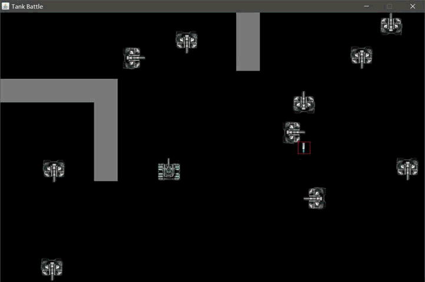

# JavaSE练手 坦克大战项目

## 1设计模式分支

**编译运行`src/TankBattle/TankBattle.java`以启动项目**

Ctrl开火，方向键控制方向。

### 功能

- [x] 敌我区分。子弹仅能对敌军有效。
- [x] 边缘检测。不能把坦克开到屏幕外。
- [x] 碰撞检测。不能穿墙，被敌军子弹打中会死，子弹打中墙会消失，不能穿过其它坦克。
- [x] 爆炸效果。
- [x] 敌军随机生成、移动、开火。
- [x] 不同的炮弹发送策略。
- [ ] 不同按键发送不同炮弹。
- [ ] 开局3秒无敌效果。防见光死。
- [ ] buffer道具。
- [ ] 不同的地图。
- [ ] 计分。
- [ ] 关卡设计。

# 2 网络版-Netty分支

**1启动**

**先运行`server.java​`,再运行`client.java`。可以运行多个`client.java`，实现多人游戏。**

